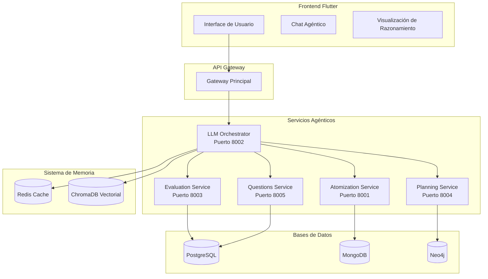

# 🧠 Atomia - Sistema Agéntico Educativo Avanzado

<div align="center">


**La próxima generación de educación personalizada con IA agéntica**

[](https://python.org)
[](https://flutter.dev)
[](https://fastapi.tiangolo.com)
[](https://langchain.com)
[](https://redis.io)

</div>

## 🚀 ¿Qué es Atomia?

Atomia es un **sistema agéntico educativo revolucionario** que implementa aprendizaje personalizado basado en principios pedagógicos científicos. Combina capacidades de razonamiento avanzado con herramientas educativas especializadas para atomizar contenido, generar preguntas adaptativas, evaluar respuestas y personalizar rutas de aprendizaje usando agentes de IA con memoria y razonamiento.

### 🤖 Capacidades Agénticas Únicas

- **🧠 Agente Educativo ReAct**: Razonamiento educativo con LangChain
- **💾 Memoria Multi-Nivel**: Corto plazo, largo plazo (Redis), semántica (ChromaDB)
- **🛠️ Herramientas Especializadas**: 4 herramientas educativas para búsqueda, seguimiento, generación y evaluación
- **🔄 Workflow Plan-Execute-Observe-Reflect**: Ciclo completo de razonamiento con LangGraph
- **🎯 Orquestador Agéntico**: Gestiona el razonamiento educativo completo

## 🏗️ Arquitectura del Sistema



## 🎓 Principios Pedagógicos Implementados

### 1. **Skinner's Teaching Machine**
- ✅ **Microlearning**: Contenido dividido en átomos mínimos
- ✅ **Feedback Inmediato**: Respuesta instantánea a cada acción
- ✅ **Participación Activa**: Engagement constante del usuario
- ✅ **Dificultad Progresiva**: Incremento gradual de complejidad

### 2. **Repetición Espaciada (SM-2)**
- ✅ **Factor de Facilidad**: Ajuste dinámico 1.3-2.5
- ✅ **Cálculo de Intervalos**: Algoritmo científico de revisión
- ✅ **Evaluación de Calidad**: Escala 0-5 de respuestas
- ✅ **Programación Adaptativa**: Basada en curvas de olvido

### 3. **Aprendizaje Activo**
- ✅ **Preguntas de Alto Nivel**: Análisis, síntesis, evaluación
- ✅ **Scaffolding**: Soporte gradual removible
- ✅ **Metacognición**: Reflexión sobre el proceso de aprendizaje
- ✅ **Construcción de Conexiones**: Relación con conocimiento previo

### 4. **Refuerzo Intermitente**
- ✅ **Horario Variable**: Recompensas impredecibles
- ✅ **Balance Intrínseco/Extrínseco**: Motivación dual
- ✅ **Reconocimiento de Logros**: Celebración del progreso
- ✅ **Gamificación**: Puntos, insignias, niveles

## 🚀 Inicio Rápido

### Prerrequisitos

```bash
# Python 3.11+
python --version

# Node.js para herramientas
node --version

# Flutter 3.19+
flutter --version

# Docker y Docker Compose
docker --version
docker-compose --version
```

### Instalación

1. **Clonar el repositorio**:
```bash
git clone https://github.com/tu-usuario/atomia.git
cd atomia
```

2. **Configurar entorno Python**:
```bash
python -m venv venv
source venv/bin/activate  # Linux/Mac
# o venv\Scripts\activate  # Windows
```

3. **Instalar dependencias**:
```bash
# Backend services
pip install -r backend/requirements-base.txt

# LLM Orchestrator (Core Agéntico)
pip install -r backend/services/llm_orchestrator/requirements.txt

# Frontend Flutter
cd frontend
flutter pub get
```

4. **Configurar bases de datos**:
```bash
# PostgreSQL, MongoDB, Neo4j, Redis
./infrastructure/scripts/setup_arch_env.sh
```

5. **Configurar variables de entorno**:
```bash
export AZURE_AI_KEY="tu-clave-azure-ai"
export REDIS_URL="redis://localhost:6379"
export MONGO_URL="mongodb://localhost:27017"
export NEO4J_URL="bolt://localhost:7687"
```

### Ejecución

```bash
# Iniciar todos los servicios backend
cd backend/services/llm_orchestrator && python -m src.main &
cd backend/services/atomization && python -m src.main &
cd backend/services/evaluation && python -m src.main &
cd backend/services/planning && python -m src.main &
cd backend/services/questions && python -m src.main &

# Iniciar frontend Flutter Web
cd frontend && flutter run -d web-server --web-port 3000
```

## 🧪 Testing del Sistema Agéntico

```bash
# Test completo del sistema agéntico
cd backend/services/llm_orchestrator
python test_server.py

# Test de servicios individuales
cd backend/services/atomization
python test_agentic_service.py

cd backend/services/evaluation
python test_evaluation_service.py
```

## 📊 API Endpoints Agénticos

### LLM Orchestrator (Puerto 8002)
- `POST /agent/process` - Procesar tarea educativa con razonamiento
- `GET /agent/memory/search` - Búsqueda en memoria semántica
- `GET /agent/context/{user_id}` - Contexto completo del usuario

### Atomization Service (Puerto 8001)
- `POST /api/v1/atomization/atomize` - Atomizar contenido educativo
- `GET /api/v1/atomization/atoms/{topic}` - Obtener átomos por tema

### Evaluation Service (Puerto 8003)
- `POST /api/v1/evaluation/evaluate` - Evaluar respuesta del usuario
- `GET /api/v1/evaluation/feedback/{evaluation_id}` - Obtener retroalimentación

## 🔧 Tecnologías del Stack Agéntico

### Backend Agéntico
- **🤖 LangChain + LangGraph**: Framework agéntico principal
- **🧠 DeepSeek R1**: LLM principal vía Azure AI
- **⚡ FastAPI**: APIs de alto rendimiento
- **🔄 Pydantic**: Validación de esquemas agénticos
- **📊 Redis**: Memoria persistente del agente
- **🔍 ChromaDB**: Búsqueda vectorial semántica

### Frontend Multiplataforma
- **📱 Flutter**: UI multiplataforma moderna
- **🏗️ BLoC**: Gestión de estado reactiva
- **🌐 Web/Mobile**: Compatibilidad universal

### Bases de Datos
- **🐘 PostgreSQL**: Datos estructurados
- **🍃 MongoDB**: Átomos de aprendizaje
- **🕸️ Neo4j**: Grafo de conocimiento
- **⚡ Redis**: Cache agéntico
- **🔍 ChromaDB**: Vectores semánticos

## 📈 Métricas y Monitoreo

El sistema incluye métricas específicas para capacidades agénticas:

- **⏱️ Duración de tareas educativas**
- **🔢 Pasos de razonamiento por tarea**
- **🛠️ Uso de herramientas educativas**
- **💾 Rendimiento de memoria**
- **🎯 Efectividad pedagógica**

## 🗂️ Estructura del Proyecto

```
atomia/
├── 🤖 backend/services/llm_orchestrator/    # Sistema agéntico core
├── ⚛️ backend/services/atomization/         # Atomización de contenido
├── 📊 backend/services/evaluation/          # Motor de evaluación
├── 📅 backend/services/planning/            # Planificador adaptativo
├── ❓ backend/services/questions/           # Generador de preguntas
├── 📱 frontend/                             # Flutter multiplataforma
├── 🗄️ backend/shared/                       # Modelos compartidos
├── 📖 docs/                                 # Documentación
└── 🔧 infrastructure/                       # Scripts y configuración
```

## 🤝 Contribución

1. Fork el proyecto
2. Crea una rama feature (`git checkout -b feature/nueva-capacidad-agentica`)
3. Implementa siguiendo los principios agénticos en `.cursorrules`
4. Commit (`git commit -m 'feat: Add new agentic capability'`)
5. Push (`git push origin feature/nueva-capacidad-agentica`)
6. Abre un Pull Request

## 📄 Licencia

Este proyecto está bajo la Licencia MIT. Ver `LICENSE` para más detalles.

## 🌟 Características Destacadas

- ✅ **Primer sistema educativo completamente agéntico**
- ✅ **Razonamiento artificial educativo avanzado**
- ✅ **Memoria contextual persistente multi-nivel**
- ✅ **Principios pedagógicos científicos aplicados**
- ✅ **Arquitectura de microservicios escalable**
- ✅ **Frontend multiplataforma moderno**
- ✅ **Testing exhaustivo del sistema agéntico**

---

<div align="center">

**🧠 Atomia - Transformando la educación con inteligencia artificial agéntica**

[Documentación](./docs/) • [Demos](./demos/) • [Contribuir](./CONTRIBUTING.md) • [Issues](./issues/)

</div> 